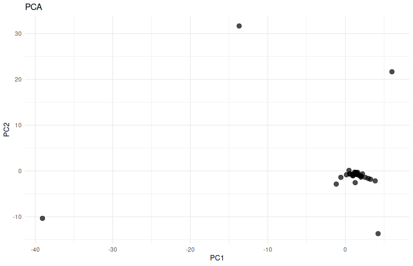
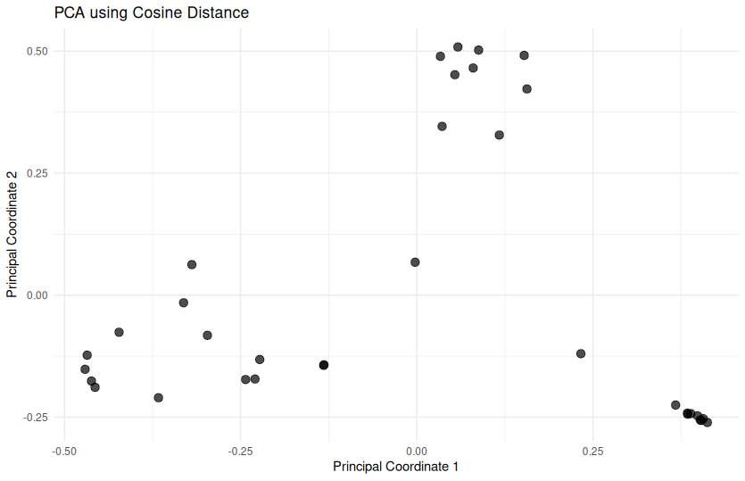
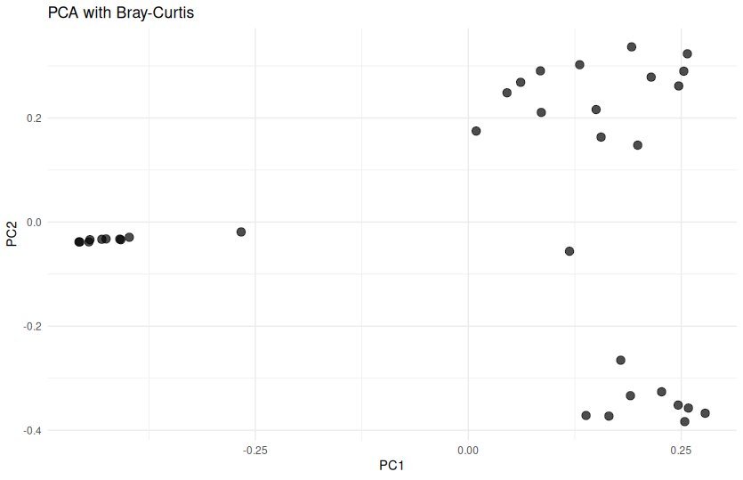

# Анализ данных 16S

## Оценка качества и фильтрация прочтений

Нам было предоставлено 36 файлов в формате FASTA, а также метаданные, включающие информацию о группе образцов (sample 1 или 2), использовании антибиотиков и дне взятия пробы.

### Оценка качества

Качество прочтений было оценено с использованием FastQC и суммировано с помощью MultiQC. На основании анализа было установлено, что качество прочтений падает с 85 по 130 нуклеотид. Это потребовало проведения фильтрации данных.

### Фильтрация по качеству

Для фильтрации данных использовался инструмент Trimmomatic с параметрами:

- **SLIDINGWINDOW:4:20** — обрезка по качеству с использованием скользящего окна длиной 4 и порогом качества 20.
- **MINLEN:50** — удаление прочтений длиной менее 50 нуклеотидов.

Настройки фильтрации были реализованы в скрипте cut.sh.

Дальнейший анализ проводился в R с использованием пакета DADA2.

Данные были дополнительно отфильтрованы с помощью функции `filterAndTrim`. Были использованы следующие параметры:

- **maxN=0** — удаляются прочтения с любым количеством неидентифицированных нуклеотидов (N).
- **maxEE=2** — допускается не более двух ожидаемых ошибок для прочтения.
- **truncQ=2** — обрезка прочтений при качестве ниже 2.
- **rm.phix=TRUE** — удаление последовательностей PhiX (контрольная последовательность для Illumina).

### Ординация данных

Для визуализации структуры данных была проведена ординация с использованием метода главных компонент (PCA) на основе Евклидовой метрики. 

Результаты PCA с использованием двух компонент не выявили чёткого разделения образцов на кластеры. В связи с этим было решено использовать другие метрики схожести: **косинусное расстояние** и **сходство Брея-Кертиса**.

Эти методы показали визуальное разделение образцов на три кластера:

    
    

Для дальнейшего анализа было решено использовать **сходство Брея-Кертиса**.
