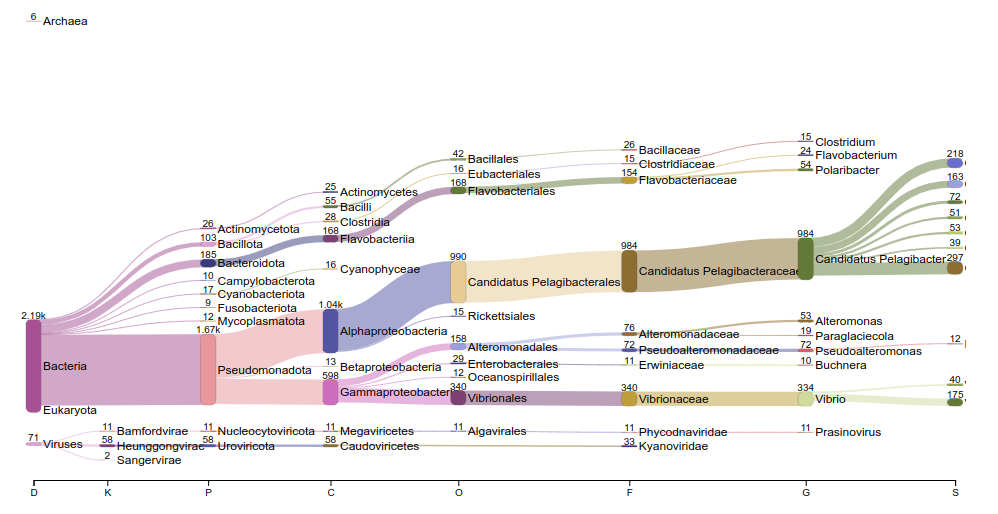

# Метагеномный анализ

Образец `TB2_SN3` представляет собой метагеном паразита рода **Metchnikovella**, который живет внутри другого паразита — представителя рода **Selenidium**. Хозяином третьего уровня в этой системе является организм **Travisia forbesii**, морской червь, обитающий в придонных слоях океана.

Целью работы было определить таксономический состав микробиома образца, провести реконструкцию метагеномно-ассемблированных геномов (MAG) и оценить их качество.

## Анализ таксономического состава

Для определения состава микробного сообщества использовался инструмент `kraken2`, который позволяет классифицировать последовательности на основе сопоставления с базами данных таксонов. Исходный файл `scaffolds_TB2_SN3.fasta` был проанализирован с использованием базы данных Kraken, оптимизированной для морских организмов. Результаты были иллючтрированы с помощью Pavian.

### Результаты классификации
Анализ показал, что лишь 12,20% последовательностей были классифицированы, в то время как 87,81% остались неклассифицированными. Это может указывать на присутствие редких или недостаточно изученных организмов в данном микробиоме.

Среди классифицированных последовательностей выделяются следующие таксоны:

1. **Candidatus Pelagibacter ubique** (297 последовательностей):
   - Один из самых распространенных морских микробов, относящийся к группе SAR11. Этот организм играет ключевую роль в углеродном цикле и обладает небольшим, но эффективным геномом (~1,3 Мб).

2. **Candidatus Pelagibacter giovannonii** (218 последовательностей):
   - Близкородственный вид, адаптированный к олиготрофной среде, характерной для открытого океана.

3. **Vibrio splendidus** (175 последовательностей):
   - Представитель рода Vibrio, известный как патоген морских организмов. Этот вид также участвует в разложении органического материала, что может быть связано с процессами внутри системы паразита.

4. **Candidatus Pelagibacter sp. FZCC0015** (163 последовательности):
   - Еще один представитель SAR11, выделенный из специфических экологических условий.

5. **Candidatus Pelagibacter sp. HIMB1321** (72 последовательности):
   - Обладает особенностями, характерными для адаптации к жизни в богатой кислородом морской среде.

Таксономический анализ подчеркивает доминирование морских бактерий группы SAR11, что отражает влияние среды обитания хозяина **Travisia forbesii**. Высокая доля неклассифицированных последовательностей свидетельствует о наличии уникальной микробиоты, связанной с данной паразитической системой. Присутствие Vibrio splendidus может быть связано с процессами разложения или патогенной активностью, направленной на хозяина.

## Биннинг и оценка качества геномов

Для реконструкции геномов использовались два инструмента: MetaBAT2 и MaxBin2. Цель заключалась в выделении метагеномно-ассемблированных геномов, которые могли бы представлять микроорганизмы, вовлеченные в изучаемую систему.

MetaBAT2 и MaxBin2 сгенерировали несколько бинов. Среди них только один бин (`bin.2`), полученный с помощью MetaBAT2, соответствовал критериям среднего качества (по стандартам MIMAG):
- Полнота: 58,88%
- Контаминация: 8,81%

Низкая полнота MAG может быть связана с фрагментированностью исходных данных или сложностью сборки генома паразита. Однако выбранный MAG все же может содержать ключевую информацию о функциональных и филогенетических особенностях организма.

## Анализ функционального потенциала

Для оценки функционального потенциала был проведен анализ с использованием AntiSMASH, направленный на поиск генов, связанных с синтезом вторичных метаболитов.

Кластеры генов вторичных метаболитов в MAG не были идентифицированы. Это может быть связано с редукцией генома, характерной для паразитов, которые часто утрачивают функции, не связанные с паразитизмом.

Отсутствие кластеров вторичных метаболитов подтверждает гипотезу о сильной адаптации данного организма к паразитическому образу жизни. Геном, вероятно, содержит минимальный набор генов, необходимых для внутриклеточного паразитизма.

## Заключение
Анализ метагенома образца `TB2_SN3` позволил реконструировать один MAG среднего качества. Таксономический состав микробиоты образца представлен доминирующими морскими бактериями группы SAR11 и организмами рода Vibrio. Эти данные указывают на сильное влияние морской среды хозяина третьего уровня и сложные процессы, происходящие в системе паразитизма. Отсутствие кластеров вторичных метаболитов подчеркивает адаптацию организма к специфическим условиям внутриклеточного паразитизма. Следующим шагом является аннотация MAG для более детального изучения его функций и биологических особенностей.
